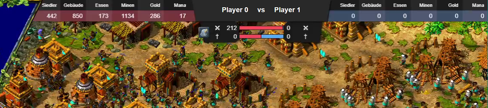

# **Advanced** Settlers 3 Stats
Read the stats and chosen races of a Settlers 3 game while running, with detailed statistics over time. Compared to other games, Settlers 3 has very limited statistics that only show a snapshot at the time you leave the game. It turned out that it is very easy to read the statistics. 


Players soldier percentage over time, the vertical lines mark the first manna upgrade for level 2 and level 3.

#### Upcoming Features

- [ ] Integrated websocket server
- [ ] Load and continue recording of savegames
- [ ] Improved file format for saves
- [ ] ImGUI interface with recordings and plots
- [ ] Automatic appearance and hiding of the overlay

- [ ] 1v1 overlay showing the available spells
- [ ] 2v2 overlay

## Table of Contents

- [s3Reader](#s3reader)
- [Plots](#plots)
- [Twitch Overlay](#twitch-overlay)

## s3Reader

The s3Reader reads the Settlers 3 statistics while the game is running. You must first start the game and then run the s3Reader as administrator. 

Note: 

- The s3Reader only works with the s3_alobby.exe 
- If you click inside the terminal window the program will be terminated

### Build Instructions

1. Requirements:

   - Visual Studio 2019
   - CMake 3.19+
   - LLVM (if you prefer Clang over the MSVC compiler)

2. Create a separate build directory

   ```shell
   $ mkdir build
   $ cd build
   ```

3.  Configure the project and generate a native build system
   
    ```shell
    $ cmake -G"Visual Studio 16 2019" -T ClangCL ..
    ```
    If you stick with the MSVC Compiler use
    ```shell
    $ cmake ..
    ```

4. Call the build system to compile/link the project

    ```shell
    $ cmake --build . --config Release
    ```

## Plots

Matplotlib is used to create plots. 

Note: Only for prototyping

1. Requirements:

   - Miniconda installation

2. Create the environment from the `environment.yml` file: 
   ```shell
   $ conda env create -f environment.yml
   ```
   - Activate the new environment with: `$ conda activate s3`
   - Verify that the new environment was installed correctly: `$ conda env list`

3. Place matplotlib stylesheet in the `stylelib` folder 
   ```
   ../.conda/envs/s3/Lib/site-packages/matplotlib/mpl-data/stylelib`
   ```

### Examples

Soldiers over time:


Team chart:


## Twitch Overlay

The twitch overlay displays the current stats for game castings. To use it you need to add a browser source in OBS Studio. 

- Activate the checkbox local file and select the `overlay.html` file
- Set width and height to `1366` and `768`
- Activate user defined FPS
- Replace the CSS stylesheet with: `body { margin: 0px auto; overflow: hidden; }`
- Activate refresh browser on scene activation

**1v1 Overlay:**



